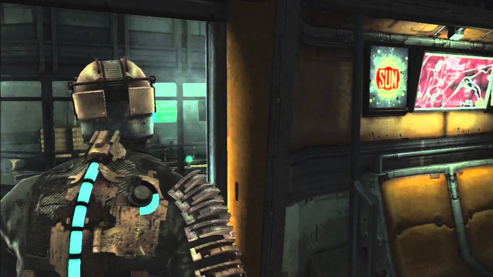

# Fully Immersive UI in Video Games

by [Manuel Velarde](mailto:manuel.velarde@proton.me)

Years ago, I read a post on [r/outside](https://www.reddit.com/r/outside/) discussing the _User Interface_ (UI) in our human experience.
One user noted that our body shows its hydration level through the color of our urine, quite an immersive interface design.
This concept deeply resonated with me, and my preferences for video game interfaces.
Rather than seeing health bars or bullet counters, I prefer a simpler, more realistic approach.

In video games, an _intradiegetic_ interface refers to elements of the UI that exist within the game's world itself.
In other words, these elements are visible to both the player and the characters within the game.
A well-known example of this can be found in the horror video games from the **Dead Space** franchise.
The player character, Isaac Clarke, has a health indicator built into his suit that players can see.

> **Figure 1:** Isaac Clarke with a full health-bar displayed on his space suit.

To continue our discussion, let's dive into some examples of intradiegetic interfaces that I believe significantly enhance game experiences:

* In the **Max Payne** series, the main character begins limping when his health drops below a certain level.
* The **Uncharted** series features characters with dialogue lines that subtly guide players towards their objectives or suggest possible routes.
* **Alien: Isolation** uses audio cues to inform Amanda Ripley and the player about the Alien's proximity, eliminating need for a separate visual radar.
* Aloy, the protagonist in **Horizon Zero Dawn**, operates a device that illuminates interactive objects in her environment.

Expanding on these instances, we can find that most intradiegetic interfaces utilize one of two mechanisms.
They rely either on the playable character's physical state as an information source for the player, or on some form of technology that presents data to both the character and the player.
Let's delve deeper into each of these distinct possibilities.

## The Playable Character's Body as an Interface

The technique of using the playable character's body as an interface offers a tremendous advantage — it's adaptable across diverse game genres and stories.
This method allows any narrative to convey information to the user, not merely those set in futuristic contexts with advanced technology.
Even when used redundantly alongside other informational sources, the inclusion of contextual visual cues enhances the gaming experience.
However, this approach extends beyond simply communicating basic character stats; it can also serve as a potent narrative tool for character development.

**Hellblade: Senua's Sacrifice** exemplifies this with its innovative use of intradiegetic user interface.
In this critically acclaimed game, all player information is delivered through elements seamlessly embedded within the game's world rather than superimposed on the screen.
Senua, the playable character, consistently hears voices — these fulfill functions like guiding the player through the world and making .
Yet the extent of their influence doesn't stop there.
These voices, at times, mock Senua or even trick the player into traps.
What sets this application of intradiegetic UI apart is how it fuses gameplay information with the portrayal of Senua's psychosis.
While other games might deploy icons or filters to communicate a character's sanity level, Hellblade maximizes immersion, offering players a uniquely immersive narrative experience.

I am very excited about what we'll see in the future for this.
Imagine seeing a character's progress in his movement from clumsy to effortless as we level up.
We have already seen awkward attempts at this, like the body types available to Carl "CJ Johnson, the protagonist in **Grand Theft Auto: San Andreas**.
Over time, players can meticulously shape his physical appearance and attributes according to the gameplay actions performed.
If CJ frequently exercises, he develops a muscular physique; if he eats excessively without working out, he gains weight.
These visible adaptations are not merely cosmetic; they also have direct implications on the character's capabilities like speed, stamina, strength in the game world, and even romancing options.

> **Figure 2:** Comparison of the .

